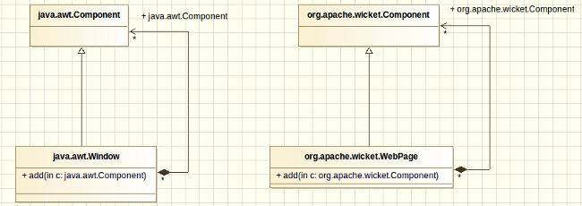
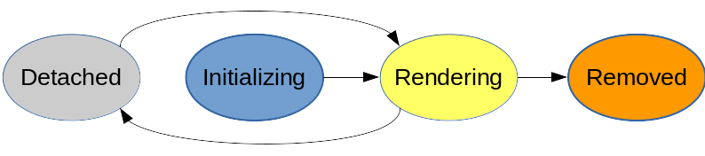
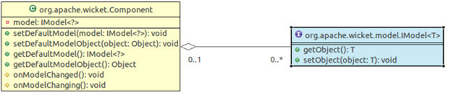

[TOC]


# Introduction to Wicket

Wicket is a Java **server-side** web **component-oriented** framework.
It simplifies the development of dynamic, interactive, and complex web applications.
With Wicket it is possible to build a web application using only Java code and XHTML compliant HTML pages. 
It provides a layer over the jakarta/javax request-response cycle, allowing unit-testing your frontend code.

**No need for Javascript, nor XML configuration files!** 

The framework's first public version was in 2005. The founders and maintainers ars still active and located in NL.
[https://wicket.apache.org/](https://wicket.apache.org/)

The current version of Wicket is 10, based on Java 17, Servlet (Version 5+) and Spring (Framework) 6. 

In order to use Wicket with a spring-boot powered application, one could use [wicket-spring-boot](https://github.com/MarcGiffing/wicket-spring-boot). Which makes it easy to create a new Wicket projects with a minimum of configuration effort. 

## Key Features:

* Component-Oriented: All elements in Wicket are treated as components, promoting reuse and separation of concerns.
* Type-Safe: Strongly-typed Java code allows for compile-time checks, reducing runtime errors.
* HTML First: Wicket encourages developers to start with HTML templates, allowing for clear separation of UI and code.
* Stateful Web Components: Supports stateful components, meaning the state of a component can be maintained across requests.
* Forms and Validation: Built-in support for complex form handling and validation, enhancing user input handling.
* Automatic Serialization: Manages the serialization of components automatically, facilitating state management across requests.

## Architecture:

* Pages and Components: The application is structured into pages (representing a complete view) and reusable components (smaller UI elements).
* Models: Wicket utilizes models (e.g., MutableModel, PropertyModel) to facilitate data binding between UI and backend Java objects.
* Request Cycle: Wicket has a sophisticated request handling cycle managing HTTP requests and responses efficiently.

## Advantages:

* Productivity: Increases developer productivity due to its intuitive design and clear separation of concerns.
* Maintainability: Easier to maintain and scale applications due to modular component architecture.
* Integration: Can easily integrate with other Java frameworks and libraries (e.g., Spring, Hibernate).
* Rich Ecosystem: A strong community and a rich set of third-party extensions and plugins available.

## Use Cases:

* Suitable for large enterprise applications, administrative interfaces, and any web application requiring a robust backend. Particularly handy for applications with complex user interactions requiring rich, dynamic content.

*Apache Wicket is a powerful and flexible framework that caters to developers looking for a comprehensive solution to web application development in Java. Its component-based architecture and rich feature set make it suitable for building modern web applications efficiently.*

<div style="page-break-after: always;"></div>

## Comparision to other Web Frameworks

### vs Spring MVC

Wicket offers a component-based approach with stateful UI, making it intuitive for Java developers, but can be complex for newcomers. Spring MVC is lightweight and flexible with a clear separation of concerns, but it requires more configuration. Wicket suits rich UIs; Spring MVC excels in RESTful services and microservices.

### vs SPAs (Single Page Applications)

Wicket, a Java web framework, offers strong typing, component-based architecture, and seamless integration with Java, making it ideal for enterprise applications. However, it can be complex and has a learning curve.

SPA (Single Page Applications) provide a smooth user experience and faster interactions, but may face SEO challenges and increased front-end complexity.

<div style="page-break-after: always;"></div>

## Basic Concepts

Apache Wicket is a component web framework written in Java and it provides a structure to design your object-oriented projects. 

Wicket allows us to design our web pages in terms of components and containers, just like AWT does with desktop windows. 


With this kind of framework our web pages and their HTML components, are pure class instances. You can use compositon and inheritance to create your application.

The core Wicket mantra is: **Divide et impera!**
Create encapsulated components, in order to setup a maintainalbe web application!

<div style="page-break-after: always;"></div>

## Benefits of component oriented frameworks for web development

1. **Web pages are objects**: web pages are not just text files sent back to the client. They are object instances and we can harness OOP to design web pages and their components. With Wicket we can also apply inheritance to HTML markup in order to build a consistent graphic layout for our applications.

2. **We don’t have to worry about an application’s state**: pages and components can be considered stateful entities. They are Java objects and they can keep a state inside them and reference other objects. We can stop worrying about keeping track of user data stored inside the `HttpSession` and we can start managing them in a natural and transparent way.

3. **Testing web applications is much easier**: since pages and components are pure objects, you can use JUnit to test their behavior and to ensure that they render as expected. Wicket has a set of utility classes for unit testing that simulate user interaction with web pages, hence we can write acceptance tests using just JUnit without any other test framework.

<div style="page-break-after: always;"></div>

## General Wicket Configuration

To configure wicket you need to extend a class called `WebApplication` and override its methods.

```java
public class HelloWorldApplication extends WebApplication {
    @Override
    public Class<? extends Page> getHomePage() {
        return HelloWorldPage.class;
    }
}
```

*This configuration is easier if we use the spring-boot integration.*

<div style="page-break-after: always;"></div>

## Component's Lifecycle Stages and Methods

**Everything** you work on wicket is a **component** (e.g. Labels, WebPage, Panel, etc).
So, you should take a look at `org.apache.wicket.Component` in order to think that every single label you work with is a component and it has its own life cycle methods callbacks.

### Stages of a component

1. Initialization: a component is instantiated and initialized by Wicket
2. Rendering: components are prepared for rendering and generate markup
3. Removed: this stage is triggered when a component is explicitly removed from its component hierarchy
4. Detached: after request processing has ended all components are notified to detach any state that is no longer needed



### Hooks in java code

```java
public class HelloWorldPage extends WebPage {
    public HelloWorld() {
    }

    // Life cycle methods
    // INITIALIZATION STAGE
    @Override
    protected void onInitialize() {
        super.onInitialize();
        add(new Label("hello", () -> "Hello World!")); // label with an simple model
        // Code here
    }
    // RENDERING STAGE
    @Override
    protected void onConfigure() {
        super.onConfigure();
        // Code here
    }
    @Override
    protected void onBeforeRender() {
        // Code here
        super.onBeforeRender();
    }
    @Override
    protected void onComponentTag(ComponentTag tag) {
        super.onComponentTag(tag);
        // Code here
    }
}
```

#### onInitialize()

* Performed **once** at the beginning of the component life cycle, but after constructors, therefore it can safely access getParent() or getPage() methods and work with models
* Need to call super.onInitialize() usually as the first instruction, throws `IllegalStateException` otherwise
* It is the phase where we can execute a custom initialization of our component. Typically compose your component with other components, i.e. add labels to a page

#### onConfigure()

* Called **everytime** before the render phase starts
* It is a good point to manage the component states such as its visibility or enabled state

#### onBeforeRender()

* Right place to add and remove children components if you have dymnic content

#### onComponentTag()

* It is called to process component tag
* We can manipulate the component's tag which is rendered, i.e. adding or removing attributes

#### Others

There are more hooks you can interact with the component's lifecycle, but they are rarely used:

* `onComponentTagBody`
* `renderHead`
* `onAfterRender`
* `onRemove`
* `onDetach`

<div style="page-break-after: always;"></div>

## Models

Components are closely tied to another important Wicket concept called models. In Wicket, a model, class implementing the `IModel` interface, acts as the **source of data for a component**. 
Model is essentially a facade interface which allows components to access and modify their data without knowing any detail about how they are managed or persisted. 



These classes exist to help the components locate your actual model object; i.e., they act as another level of indirection between Wicket components and the actual model object. This indirection is of great help when the actual object is not available at the time of component construction and instead needs to be retrieved from somewhere else at runtime.

Models are at the core of Wicket and they are the basic ingredient needed to taste the real power of the framework.

```java
@FunctionalInterface
public interface IModel<T> {
    // Gets the model object, functional interface's method
    T getObject(); 

    //Sets the model object.
    default void setObject(final T object) {...}
}
```

<div style="page-break-after: always;"></div>

## Markup and Rendering - pure XHTML with wicket tags and attributes

Wicket components are Java classes with supporting HTML markup. Most Wicket components are designed to be customized for 
your specific needs. Components may be customized by creating anonymous classes or concrete subclasses.

Component's markup code is places next to the Java class, implementing it.

```tree
└── demo1
    └── src
        ├── main
        │   ├── java
        │   │   └── com
        │   │       └── ing
        │   │           ├── HelloWorldPage.html
        │   │           ├── HelloWorldPage.java
        │   │           └── HelloWorldApplication.java
        ...
```

Markup of our `HelloWorldPage` page, named `HelloWorldPage.html`.

```html
<?xml version="1.0" encoding="UTF-8"?>
<!DOCTYPE html>
<html>
    <body>
        Some fancy simple text.
       <span wicket:id="hello">this text will be replaced by the model object</span>
        <div>any other html document structure, not bothered by the framework</div>
    </body>
</html>
```

### How rendering works

1. kicks off the page rendering process by calling the `Page.render()` method
2. the Page locates the corresponding markup template and begins iterating over the HTML tags, converting them into an internal Java representation in the process
3. if a tag without `wicket:id` is found, it is rendered as is
4. if a tag with `wicket:id` is found, the corresponding Wicket component in the Page is located, and the rendering is delegated to the component
5. the Page instance is then stored in an internal store called `PageMap`, this allows back navigation in server states

[In moree detail in the documentation.](https://nightlies.apache.org/wicket/guide/10.x/single.html#_under_the_hood_of_the_request_processing)

<div style="page-break-after: always;"></div>

## Markup tags and attributes

### wicket:id

Used on any element to which you want to add a component.

```html
<span wicket:id="hellotext">Hello</span>
```

The value of the attribute is duplicated in the java code:

```java
add(new Label("hellotext", model));
```

### wicket:enclosure

Controll the visibility of markup in rendered output, depending on a certain component.

```html
<table>
    <tr wicket:enclosure="controllingChildId">
        <td>any text</td>
        <td><wicket:container wicket:id="controllingChildId"/></td>
    </tr>
</table>
```

### wicket:panel and wicket:fragment

The `wicket:panel` tag surrounds a component. This lets you wrap the component with HTML and BODY tags but, when you include it, only the content inside the `wicket:panel` tag is actually included.

```html
<html xmlns:wicket="http://wicket.apache.org">
  <body>
    <wicket:panel>
      visibel content here
    </wicket:panel>
  </body>
</html>
```

`<wicket:fragment>` - is similar to `<wicket:panel> `but its is declared in the parent's markup instead of in a separate markup file.

### wicket:extend and wicket:child

Wicket pages and components are pure Java classes, so we can easily write a page which is a subclass of another parent page. But in Wicket inheritance is not limited to the classic object-oriented code inheritance. When a class subclasses a WebPage it also inherits the HTML file of the parent class. 

Wicket can apply markup inheritance using another approach based on the tag `<wicket:child>`. This tag is used inside the parent’s markup to define where the children pages/panels can inject their custom markup.

Parent coponente, i.e. a page

```html
<html>
    <body>
        This is parent body!
        <wicket:child/>
    </body>
</html>
```

Subclass's markup.

```html
<html>
    <body>
       <wicket:extend>
          This is child body!
        </wicket:extend>
    </body>
</html>
```

Rendering result:

```html
<html>
<body>
    This is parent body!
        This is child body!
</html>
```

<div style="page-break-after: always;"></div>

#### wicket:container

Placeholder Tag, if you need controll over your markup, but do not want to have the controlling element rendered:

```html
<table>
     <wicket:container wicket:id="repeater">
          <tr><td>...</td></tr>
          <tr><td>...</td></tr>
     </wicket:container>
</table>
```

# Wicket with Spring-Boot

To make it easy with spring-boot there is a lib out there which uses autoconfiguration to setup your Wicket enhanced web application. It registers the webfilter and autoconfigures the Wicket core and any other extension which is present on the classpath.

In order to start, add this dependency:

```xml
<dependency>
  <groupId>com.giffing.wicket.spring.boot.starter</groupId>
  <artifactId>wicket-spring-boot-starter</artifactId>
</dependency>
```

[and follow these directions... ](https://github.com/MarcGiffing/wicket-spring-boot?tab=readme-ov-file#getting-started)

You will end up with a ready to use Wicket application based on the Spring-Boot stack. This setup I will use in the

```text
________  _______   _____ ______   ________     
|\   ___ \|\  ___ \ |\   _ \  _   \|\   __  \    
\ \  \_|\ \ \   __/|\ \  \\\__\ \  \ \  \|\  \   
 \ \  \ \\ \ \  \_|/_\ \  \\|__| \  \ \  \\\  \  
  \ \  \_\\ \ \  \_|\ \ \  \    \ \  \ \  \\\  \ 
   \ \_______\ \_______\ \__\    \ \__\ \_______\
    \|_______|\|_______|\|__|     \|__|\|_______|
```
